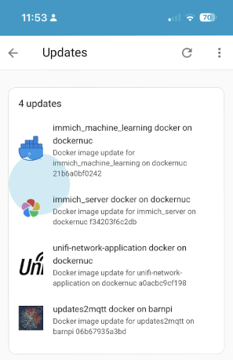
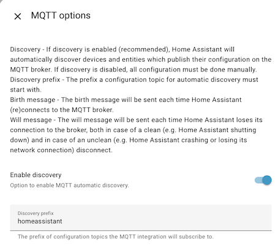
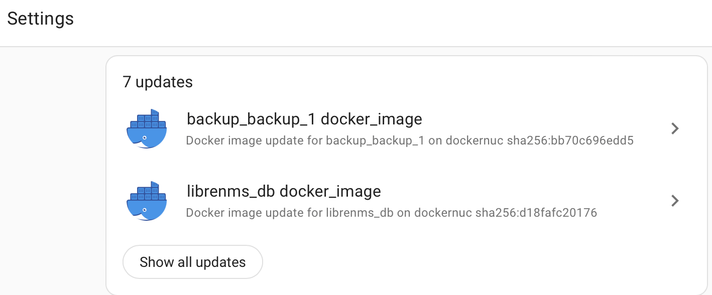

[](https://github.com/rhizomatics)

# updates2mqtt

[](https://github.com/rhizomatics/supernotify)
[](https://results.pre-commit.ci/latest/github/rhizomatics/updates2mqtt/main)
[](https://github.com/rhizomatics/updates2mqtt/actions/workflows/pypi-publish.yml)
[](https://github.com/rhizomatics/updates2mqtt/actions/workflows/python-package.yml)
[](https://github.com/rhizomatics/updates2mqtt/actions/workflows/github-code-scanning/codeql)
[](https://github.com/rhizomatics/updates2mqtt/actions/workflows/dependabot/dependabot-updates)

## Summary

Use Home Assistant to notify you of updates to Docker images for your containers and optionally perform the *pull* (or optionally *build*) and *update*.



## Description

updates2mqtt perioidically checks for new versions of components being available, and publishes new version info to MQTT.
HomeAssistant auto discovery is supported, so all updates can be seen in the same place as Home Assistant's
own components and add-ins.

Currently only Docker containers are supported, either via an image registry check, or a git repo for source. The design is modular, so other update sources can be added, at least for notification. The next anticipated is **apt** for Debian based systems.

Components can also be updated, either automatically or triggered via MQTT, for example by hitting the *Install*
button in the HomeAssistant update dialog. Icons and release notes can be specified for a better HA experience.

## Install

updates2mqtt prefers to be run inside a Docker container.

### Manual - Run without installing using uv
```
uv run --with updates2mqtt updates2mqtt
```

### Manual - Install and run with pip
```
pip install updates2mqtt
python3 -m updates2mqtt
```
### Docker

See `examples` directory for a working `docker-compose.yaml`.

If you want to update and restart containers, then the file system paths to the location of the
directory where the docker compose file lives must be available in the updates2mqtt container. 

The example `docker-compose.yaml` mounts `/home/containers` for this purpose, so if your containers are in
`/home/containers/app1`, `/home/containers/app2` etc, then updates2mqtt will be able to find them. Map as
many root paths as needed.

## Configuration

Create file `config.yaml` in `conf` directory. If the file is not present, a default file will be generated.

### Example configuration file

This is a maximal config file, the minimum is no config file at all, which will generate a default config file. The only mandatory values are the MQTT user name and password, everything else can be omitted.

```yaml

node:
  name: docker-host-1 # Unique name for this instance, used to name MQTT entities. Defaults to O/S hostname
  git_repo_path: /usr/bin/git # Path to git inside container, needed only if non-default and using local docker builds
  healthcheck:
    enabled: true
    interval: 300 # publish a heartbeat every 5 minutes
    topic_template: healthcheck/{node_name}/updates2mqtt
mqtt:
  host: ${oc.env:MQTT_HOST}
  user: ${oc.env:MQTT_USER}
  password: ${oc.env:MQTT_PASS}$ # Use an environment variable for secrets
  port: ${oc.env:MQTT_PORT}
  topic_root: updates2mqtt
homeassistant:
  discovery:
    prefix: homeassistant # Matches the default MQTT discovery prefix in Home Assistant
    enabled: true
  state_topic_suffix: state
docker:
  enabled: true
  allow_pull: true # if true, will do a `docker pull` if an update is available
  allow_restart: true # if true, will do a `docker-compose up` if an update is installed
  allow_build: true # if true, will do a `docker-compose build` if a git repo is configured
  compose_version: v2 # Controls whether to use `docker-compose` (v1) or `docker compose` (v2) command
  default_entity_picture_url: https://www.docker.com/wp-content/uploads/2022/03/Moby-logo.png # Picture for update dialog
  device_icon: mdi:docker # Material Design Icon to use when browsing entities in Home Assistant
  # device_icon: mdi:train-car-container # Alternative icon if you don't like Docker branding
  discover_metadata:
    linuxserver.io:
      enabled: true
      cache_ttl: 604800 # cache metadata for 1 week
scan_interval: 10800 # sleep interval between scan runs, in seconds
log:
  level: INFO
```

### Moving Secrets Out of Config

Example use of environment variables, e.g. for secrets:

```
mqtt:
    password: ${oc.env:MQTT_PASS}
```
### Customizing images and release notes

Individual docker containers can have customized entity pictures or release notes, using env variables, for example in the `docker-compose.yaml` or in a separate `.env` file:

```
    environment:
      - UPD2MQTT_PICTURE=https://frigate.video/images/logo.svg
      - UPD2MQTT_RELNOTES=https://github.com/blakeblackshear/frigate/releases
```

The images will show up in the *Update* section of *Settings* menu in HomeAssistant,
as will the release notes link. SVG icons should be used.

Some popular services have the icon and release note links pre-configured, in `common_packages.yaml`,
and packages from `linuxserver.io` can have metadata automatically discovered.

#### Icon Sources

- [Homarr Dashboard Icons](https://github.com/homarr-labs/dashboard-icons)
- [Self Hosted Icons](https://github.com/selfhst/icons)
- [Simple Icons](https://github.com/simple-icons/simple-icons)
- [Tabler Icons](https://tabler.io/icons)
- [Papirus Icons](https://github.com/PapirusDevelopmentTeam/papirus-icon-theme)
- [Homelab SVG Assets](https://github.com/loganmarchione/homelab-svg-assets)

### Automated updates

If Docker containers should be immediately updated, without any confirmation
or trigger, *e.g.* from the HomeAssistant update dialog, then set an environment variable `UPD2MQTT_UPDATE`
in the target container to `Auto` ( it defaults to `Passive`)

### Custom docker builds

If the image is locally built from a checked out git repo, package update can be driven
by the availability of git repo changes to pull rather than a new image on a Docker registry.

Declare the git path using the env var in ``UPD2MQTT_GIT_REPO_PATH`` in the docker container ( directly or via an ``.env`` file).
The git repo at this path will be used as the source of timestamps, and an update command will carry out a 
``git pull`` and ``docker-compose build`` rather than pulling an image.

Note that the updates2mqtt docker container needs access to this path declared in its volumes, and that has to
be read/write if automated install required.

### Environment Variables

The following environment variables can be used to configure updates2mqtt:

| Env Var | Description | Default  |
|---------| ------------|----------|
| `UPD2MQTT_UPDATE`  | Update mode, either `Passive` or `Auto`. If `Auto`, updates will be installed automatically. | `Passive` |
| `UPD2MQTT_PICTURE`  | URL to an icon to use in Home Assistant.  | Docker logo URL   |
| `UPD2MQTT_RELNOTES` | URL to release notes for the package.  |  | 
| `UPD2MQTT_GIT_REPO_PATH` | Relative path to a local git repo if the image is built locally.  | |
| `UPD2MQTT_IGNORE` | If set to `True`, the container will be ignored by updates2mqtt. | False |


## Release Support

| Ecosystem | Support     | Comments                                                                                           |
|-----------|-------------|----------------------------------------------------------------------------------------------------|
| Docker    | Scan. Fetch | Fetch is ``docker pull`` only. Restart support only for ``docker-compose`` image based containers. |
  
## Healthcheck

A heartbeat JSON payload is optionally published periodically to a configurable MQTT topic, defaulting to `healthcheck/{node_name}/updates2mqtt`. It contains the current version of updates2mqtt, the node name, a timestamp, and some basic stats.

A `healthcheck.sh` script is included in the Docker image, and can be used as a Docker healthcheck, if the container environment variables are set for `MQTT_HOST`, `MQTT_PORT`, `MQTT_USER` and `MQTT_PASS`.

TIP: Check healthcheck is working using `docker inspect --format "{{json .State.Health }}" updates2mqtt | jq`
  
## HomeAssistant integration

Any updates that have support for automated install will automatically show in the
Home Assistant settings page if the [MQTT Integration](https://www.home-assistant.io/integrations/mqtt/) is installed and automatic discovery is not disabled.



The `homeassistant` default topic prefix matches the default updates2mqtt config, if its changed in HomeAssistant, then the updates2mqtt config must be changed to match.



For Home Assistant integration, updates2mqtt represents each component being managed as a [MQTT Update](https://www.home-assistant.io/integrations/update.mqtt/) entity, and uses [MQTT discovery(https://www.home-assistant.io/integrations/mqtt/#mqtt-discovery)] so that HomeAssistant automatically picks up components discovered by updates2mqtt with zero configuration on HomeAssistant itself. 

There are 3 separate types of MQTT topic used for HomeAssisstant integration:

- *Config* to support auto discovery. A topic is created per component, with a name like `homeassistant/update/dockernuc_docker_jellyfin/update/config`. This can be disabled in the config file, and the `homeassistant` topic prefix can also be configured.
- *State* to report the current version and the latest version available, again one topic per component, like `updates2mqtt/dockernuc/docker/jellyfin`.
- *Command* to support triggering an update. These will be created on the fly by HomeAssistant when an update is requested, and updates2mqtt subscribes to pick up the changes, so you won't typically see these if browsing MQTT topics. Only one is needed per updates2mqtt agent, with a name like `updates2mqtt/dockernuc/docker`

If the package supports automated update, then *Skip* and *Install* buttons will appear on the Home Assistant
interface, and the package can be remotely fetched and the component restarted.

## Related Projects

- [psmqtt](https://github.com/eschava/psmqtt) - Report system health and metrics via MQTT
- 
## Development

Access to Docker APIs uses the Python [docker-py](https://docker-py.readthedocs.io/en/stable/) SDK for Python. [Eclipse Paho](https://eclipse.dev/paho/files/paho.mqtt.python/html/client.html) is used for MQTT access, and [OmegaConf](https://omegaconf.readthedocs.io) for configuration.
