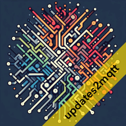
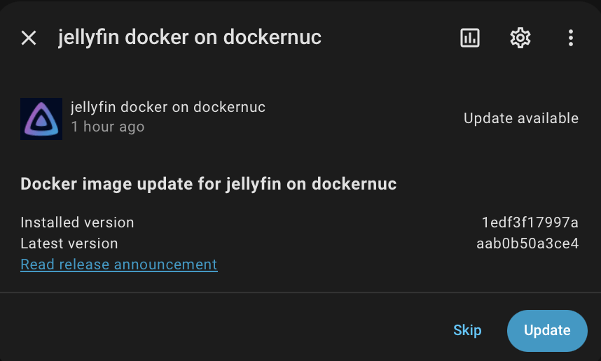

{ align=left }

# updates2mqtt

[](https://github.com/rhizomatics)

[](https://pypi.org/project/updates2mqtt/)
[](https://github.com/rhizomatics/supernotify)
[](https://updates2mqtt.rhizomatics.org.uk/developer/coverage/)

[](https://results.pre-commit.ci/latest/github/rhizomatics/updates2mqtt/main)
[](https://github.com/rhizomatics/updates2mqtt/actions/workflows/pypi-publish.yml)
[](https://github.com/rhizomatics/updates2mqtt/actions/workflows/python-package.yml)
[](https://github.com/rhizomatics/updates2mqtt/actions/workflows/github-code-scanning/codeql)
[](https://github.com/rhizomatics/updates2mqtt/actions/workflows/dependabot/dependabot-updates)


<br/>
<br/>


## Summary

Let Home Assistant tell you about new updates to Docker images for your containers.


Read the release notes, and optionally click *Update* to trigger a Docker *pull* (or optionally *build*) and *update*.

{width=480}


## Description

updates2mqtt perioidically checks for new versions of components being available, and publishes new version info to MQTT. HomeAssistant auto discovery is supported, so all updates can be seen in the same place as Home Assistant's own components and add-ins.

Currently only Docker containers are supported, either via an image registry check, or a git repo for source (see [Local Builds](local_builds.md)). The design is modular, so other update sources can be added, at least for notification. The next anticipated is **apt** for Debian based systems.

Components can also be updated, either automatically or triggered via MQTT, for example by hitting the *Install* button in the HomeAssistant update dialog. Icons and release notes can be specified for a better HA experience. See [Home Assistant Integration](home_assistant.md) for details.

To get started, read the [Installation](installation.md) and [Configuration](configuration.md) pages.

For a quick spin, try this:

```yaml
docker run -e MQTT_USER=user1 -e MQTT_PASS=pass1 -e MQTT_HOST=192.168.1.5 ghcr.io/rhizomatics/updates2mqtt:release
```

## Release Support

Presently only Docker containers are supported, although others are planned, probably with priority for `apt`.

| Ecosystem | Support     | Comments                                                                                           |
|-----------|-------------|----------------------------------------------------------------------------------------------------|
| Docker    | Scan. Fetch | Fetch is ``docker pull`` only. Restart support only for ``docker-compose`` image based containers. |
  
## Heartbeat

A heartbeat JSON payload is optionally published periodically to a configurable MQTT topic, defaulting to `healthcheck/{node_name}/updates2mqtt`. It contains the current version of updates2mqtt, the node name, a timestamp, and some basic stats.

## Healthcheck

A `healthcheck.sh` script is included in the Docker image, and can be used as a Docker healthcheck, if the container environment variables are set for `MQTT_HOST`, `MQTT_PORT`, `MQTT_USER` and `MQTT_PASS`. It uses the `mosquitto-clients` Linux package which provides `mosquitto_sub` command to subscribe to topics.

!!! tip

    Check healthcheck is working using `docker inspect --format "{{json .State.Health }}" updates2mqtt | jq` (can omit `| jq` if you don't have jsonquery installed, but much easier to read with it)

Another approach is using a restarter service directly in Docker Compose to force a restart, in this case once a day:

```yaml title="Example Compose Service"
restarter:
    image: docker:cli
    volumes: ["/var/run/docker.sock:/var/run/docker.sock"]
    command: ["/bin/sh", "-c", "while true; do sleep 86400; docker restart updates2mqtt; done"]
    restart: unless-stopped
    environment:
      - UPD2MQTT_UPDATE=AUTO
```

## Target Containers

While `updates2mqtt` will discover and monitor all containers running under the Docker daemon,
there are some options to make to those containers to tune how it works.

These happen by adding environment variables to the containers, typically inside an `.env`
file, or as `environment` options inside `docker-compose.yaml`.

### Automated updates

If Docker containers should be immediately updated, without any confirmation
or trigger, *e.g.* from the HomeAssistant update dialog, then set an environment variable `UPD2MQTT_UPDATE` in the target container to `Auto` ( it defaults to `Passive`)

```yaml title="Example Compose Snippet"
restarter:
    image: docker:cli
    command: ["/bin/sh", "-c", "while true; do sleep 86400; docker restart mailserver; done"]
    environment:
      - UPD2MQTT_UPDATE=AUTO
```

### Environment Variables

The following environment variables can be used to configure containers for `updates2mqtt`:

| Env Var | Description | Default  |
|---------| ------------|----------|
| `UPD2MQTT_UPDATE`  | Update mode, either `Passive` or `Auto`. If `Auto`, updates will be installed automatically. | `Passive` |
| `UPD2MQTT_PICTURE`  | URL to an icon to use in Home Assistant.  | Docker logo URL   |
| `UPD2MQTT_RELNOTES` | URL to release notes for the package.  |  | 
| `UPD2MQTT_GIT_REPO_PATH` | Relative path to a local git repo if the image is built locally.  | |
| `UPD2MQTT_IGNORE` | If set to `True`, the container will be ignored by updates2mqtt. | False |


## Related Projects

Other apps useful for self-hosting with the help of MQTT:

- [psmqtt](https://github.com/eschava/psmqtt) - Report system health and metrics via MQTT

Find more at [awesome-mqtt](https://github.com/rhizomatics/awesome-mqtt)

## Development

This component relies on several open source packages:

- [docker-py](https://docker-py.readthedocs.io/en/stable/) SDK for Python for access to Docker APIs
- [Eclipse Paho](https://eclipse.dev/paho/files/paho.mqtt.python/html/client.html) MQTT client
- [OmegaConf](https://omegaconf.readthedocs.io) for configuration and validation
- [structlog](https://www.structlog.org/en/stable/) for structured logging and [rich](https://rich.readthedocs.io/en/stable/) for better exception reporting
- [hishel](https://hishel.com/1.0/) for caching metadata
- [httpx](https://www.python-httpx.org) for retrieving metadata
- The Astral [uv](https://docs.astral.sh/uv/) and [ruff](https://docs.astral.sh/ruff/) tools for development and build
- [pytest](https://docs.pytest.org/en/stable/) and supporting add-ins for automated testing
- [usingversion](https://pypi.org/project/usingversion/) to log current version info