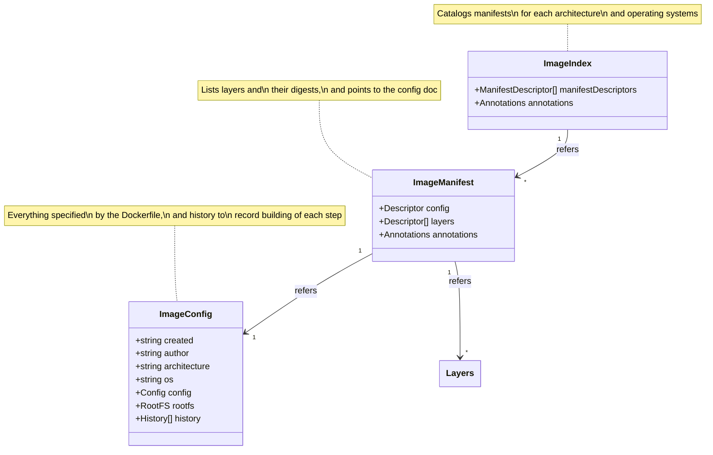

# Understanding Container Metadata


## Key Entities

Documented at the [OCI Image Format Specification](https://github.com/opencontainers/image-spec/blob/main/spec.md)


```
```
```
```
```
```
```
```
```
```
```
```
```
```
```
```
```
```
```
```
```
```
```
```
```
```
```
```
```
```
```
```
```
```
```
```
```