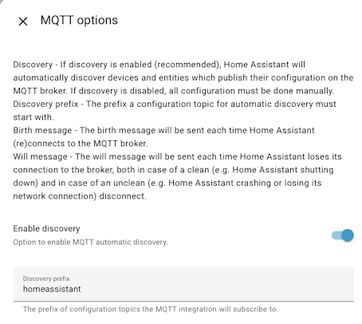
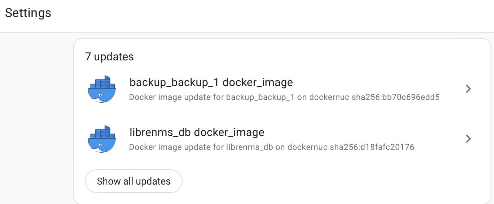

# HomeAssistant Integration

 `updates2mqtt` represents each component being managed as a [MQTT Update](https://www.home-assistant.io/integrations/update.mqtt/) entity, and uses [MQTT discovery](https://www.home-assistant.io/integrations/mqtt/#mqtt-discovery) so that HomeAssistant automatically picks up components discovered by Updates2MQTT with zero configuration on HomeAssistant itself. 

## Configuration

If Home Assistant is already running with MQTT, and the defaults haven't been changed, then
`updates2mqtt` will likely work as is, so long as its publishing to the same broker.

Any updates that have support for automated install will automatically show in the
Home Assistant settings page if the [MQTT Integration](https://www.home-assistant.io/integrations/mqtt/) is installed and automatic discovery is not disabled.

The `homeassistant` default topic prefix matches the default Updates2MQTT config, if its changed in HomeAssistant, then the Updates2MQTT config must be changed to match.

## Device Creation

A Home Assistant device will be created for each Updates2MQTT agent on each server, and Home Assistant
will then group all the relevant entities together on this device page. Use `device_creation: false` in the 
`homeassistant` config block if you want to switch off this behaviour, and `area` if you want to provide
a `suggested_area` for the device.

## MQTT Topics

There are 44 separate types of MQTT topic used for HomeAssisstant integration:

- *Config* to support auto discovery. 
    - A topic is created per component, with a name like `homeassistant/update/dockernuc_docker_jellyfin/update/config`. 
    - This can be disabled in the config file, and the `homeassistant` topic prefix can also be configured.
- *State* to report the current version and the latest version available
    - One topic per component, like `updates2mqtt/dockernuc/docker/jellyfin/state`.
- *Command* to support triggering an update. 
    - These will be created on the fly by HomeAssistant when an update is requested
    - Updates2MQTT subscribes to pick up the changes, so you won't typically see these if browsing MQTT topics. 
    - Only one is needed per Updates2MQTT agent, with a name like `updates2mqtt/dockernuc/docker`
- *JSON Attributes* sources extra attributes from the main `updates2mqtt` discovery topic
    - Switch this behaviour off using `extra_attributes` flag in HomeAssistant config

If the package supports automated update, then *Skip* and *Install* buttons will appear on the Home Assistant interface, and the package can be remotely fetched and the component restarted.

If it doesn't support automated update, the `command_topic` won't be published with the configuration
message, unless `force_command_topic` is set to `true` in the `homeassistant` configuration section,
this will force the Home Assistant app to show the update, but with a do-nothing Update button.

## Verifying it Works

Rather than wait for a container to need an update, you can check right away that
Home Assistant has recognized the containers as MQTT Update targets.

From the [Entities View](https://www.home-assistant.io/docs/configuration/entities_domains/), or the
[Developer Tools](https://www.home-assistant.io/docs/tools/dev-tools/), filter
the entities by `update.` If there are lots of other updates (HassOS apps, Zigbee
device firmware etc), then pick one of the container names you know.

{width=640}

## More Home Assistant information

- [MQTT Integration](https://www.home-assistant.io/integrations/mqtt/)
    - Includes setting up a MQTT broker, MQTT Discovery, and trouble-shooting
- [MQTT Update](https://www.home-assistant.io/integrations/update.mqtt/)
- [Update Integration](https://www.home-assistant.io/integrations/update/)