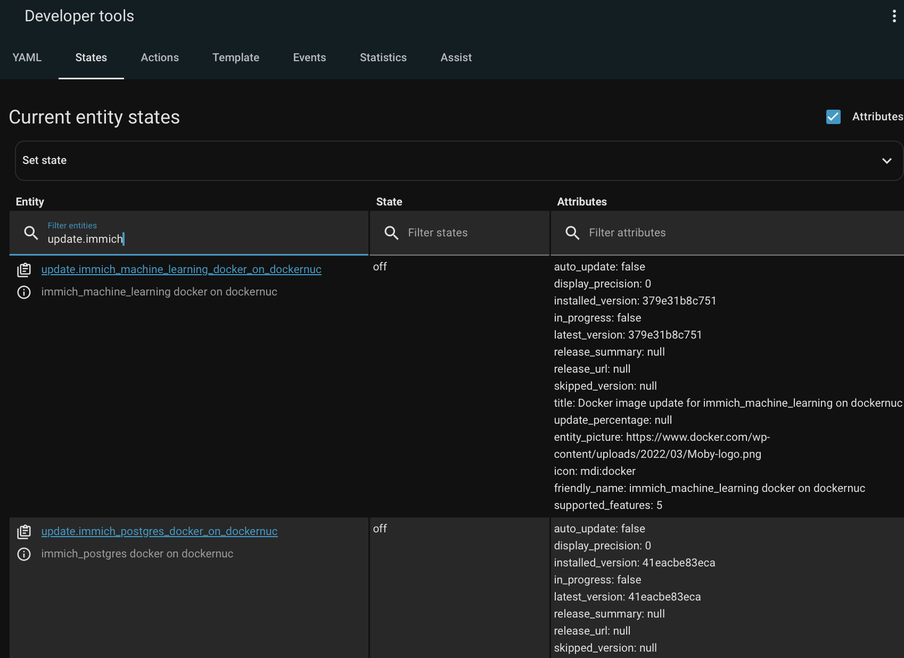

# Installation

## Install

updates2mqtt prefers to be run inside a Docker container, though can run standalone, for example scripted via cron or systemd.

The only mandatory configuration is the MQTT broker host, user name and password, which can be set by environment variables, or the config file. The node name will be taken from the operating system if there's no config file. See [Configuration](configuration.md) for details.

### Docker

See `examples` directory for a working `docker-compose.yaml`.

If you want to update and restart containers, then the file system paths to the location of the directory where the docker compose file lives must be available in the updates2mqtt container. 

```yaml
volumes:
      # Must have config directory mapped
      - ./conf:/app/conf
      # Must have the Docker daemon socket mapped
      - /var/run/docker.sock:/var/run/docker.sock
      # This list of paths is only needed when containers are to be updated
      # The paths here are completely dependent on where your docker-compose files live
      # and the internal/external paths must be exactly the same
      - /my/container/home:/my/container/home
      - /more/containers:/more/containers
```

The example `docker-compose.yaml` mounts `/my/container/home` for this purpose, so if your containers are in
`/my/container/home/app1`, `/my/container/home/app2` etc, then updates2mqtt will be able to find them in
order to restart them. Map as many root paths as needed.

### Without Docker

#### Run without installing using uv

```
uv run --with updates2mqtt updates2mqtt
```

#### Install and run with pip

```
pip install updates2mqtt
python3 -m updates2mqtt
```

## Verifying it Works

Rather than wait for a container to need an update, you can check right away that
Home Assistant has recognized the containers as MQTT Update targets.

From the [Entities View](https://www.home-assistant.io/docs/configuration/entities_domains/), or the
[Developer Tools](https://www.home-assistant.io/docs/tools/dev-tools/), filter
the entities by `update.` If there are lots of other updates (HassOS apps, Zigbee
device firmware etc), then pick one of the container names you know.

{width=640}

